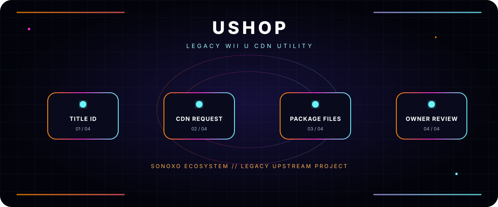

<div align="center">



# USHOP

**LEGACY WII U CDN UTILITY**

[](https://github.com/sonoxo)


</div>

## What it does

uShop is a Python utility that downloads Wii U CDN package files for a supplied title ID and version, creates a ticket in the output directory, and includes a PyQt GUI.

> Use this project only for games and content you own or are legally authorized to access. You must supply your own common key. No key is included.

## Command line

Install the original runtime dependencies:

```bash
python3 -m pip install pycryptodome PyQt5
```

Then run:

```bash
./ushop.py TITLE_ID [version]
```

GUI:

```bash
./ushop_gui.py
```

## Status

**Legacy/upstream code.** The repository documentation historically cites Python 3.5+ with uncertainty; compatibility with modern systems is not claimed here. Review the source and legal requirements before use.

## Original credits

Original uShop authorship is retained. The project credits:

- [ihaveamac](https://github.com/ihaveamac) and [wiiu-things](https://github.com/ihaveamac/wiiu-things)
- [dojafoja](https://github.com/dojafoja) and Kii-U-Generator
- [TimmSkiller](https://github.com/TimmSkiller) for Wii U ticket-structure research

This Sonoxo README treatment does not claim creation of the underlying upstream software.

---

<div align="center">

**SONOXO ECOSYSTEM** · Built to make complex tools understandable

The header animation automatically becomes static when your system requests reduced motion.

</div>
